# Self-hosted GitHub Repository Visuals

Generate star history charts and contributor walls without a hosted rendering service. The action reads GitHub's APIs inside your workflow and publishes self-contained light and dark SVG files to a branch in your repository — no third-party image host, no tracking pixels, no external requests at render time.

- **9 built-in themes** × **3 chart variants** (area, line, glow) — mix and match, or override any color.
- **3 chart layouts** — editorial, glance, and compact — independent from theme and chart variant.
- **Contributor walls** with configurable columns, avatar size, spacing, shape, and leaderboard highlighting.
- **Deterministic, offline SVG** — avatars are embedded as validated raster bytes; nothing is fetched when the image loads.

All previews below were generated locally from the `rustfs/rustfs` history on 2026-08-29 at 31,508 stars, and each one automatically switches between its tracked light and dark SVG.

## Chart layouts

Choose the information hierarchy with `chart-layout`; theme colors and `chart-variant` remain independent.

### editorial · balanced detail (default)

<picture>
  <source media="(prefers-color-scheme: dark)" srcset="assets/examples/rustfs/classic-dark.svg">
  
</picture>

### glance · current count first

<picture>
  <source media="(prefers-color-scheme: dark)" srcset="assets/examples/rustfs/layout-glance-dark.svg">
  
</picture>

### compact · shorter README card

<picture>
  <source media="(prefers-color-scheme: dark)" srcset="assets/examples/rustfs/layout-compact-dark.svg">
  
</picture>

## Chart themes

Every theme ships with a tuned light and dark palette. The heading notes each theme's default variant; you can override it with `chart-variant`.

### classic · editorial vermilion area

<picture>
  <source media="(prefers-color-scheme: dark)" srcset="assets/examples/rustfs/classic-dark.svg">
  
</picture>

### gradient · emerald → sky glow

<picture>
  <source media="(prefers-color-scheme: dark)" srcset="assets/examples/rustfs/gradient-dark.svg">
  
</picture>

### midnight · indigo → violet glow

<picture>
  <source media="(prefers-color-scheme: dark)" srcset="assets/examples/rustfs/midnight-dark.svg">
  
</picture>

### sunset · amber → rose glow

<picture>
  <source media="(prefers-color-scheme: dark)" srcset="assets/examples/rustfs/sunset-dark.svg">
  
</picture>

### ocean · cyan area

<picture>
  <source media="(prefers-color-scheme: dark)" srcset="assets/examples/rustfs/ocean-dark.svg">
  
</picture>

### forest · lime → green area

<picture>
  <source media="(prefers-color-scheme: dark)" srcset="assets/examples/rustfs/forest-dark.svg">
  
</picture>

### flame · orange → red glow

<picture>
  <source media="(prefers-color-scheme: dark)" srcset="assets/examples/rustfs/flame-dark.svg">
  
</picture>

### minimal · crisp line

<picture>
  <source media="(prefers-color-scheme: dark)" srcset="assets/examples/rustfs/minimal-dark.svg">
  
</picture>

### mono · monochrome line

<picture>
  <source media="(prefers-color-scheme: dark)" srcset="assets/examples/rustfs/mono-dark.svg">
  
</picture>

## Contributor wall

Set `contributors: "true"` to render the top non-bot contributors, ordered by contribution count. Avatars are downloaded during the workflow, validated as raster images, and embedded directly in the SVG. The leaderboard's top three get an accent ring, and a missing avatar falls back to the contributor's initial. The wall follows the same theme as the chart.

<picture>
  <source media="(prefers-color-scheme: dark)" srcset="assets/examples/rustfs/contributors-dark.svg">
  
</picture>

### Themes and avatar shapes

`avatar-shape` accepts `circle`, `squircle`, or `square`, and every chart theme applies to the wall too. These showcase walls use a reduced set of contributors.

**sunset · squircle**

<picture>
  <source media="(prefers-color-scheme: dark)" srcset="assets/examples/rustfs/contributors-sunset-dark.svg">
  
</picture>

**midnight · circle**

<picture>
  <source media="(prefers-color-scheme: dark)" srcset="assets/examples/rustfs/contributors-midnight-dark.svg">
  
</picture>

**mono · square**

<picture>
  <source media="(prefers-color-scheme: dark)" srcset="assets/examples/rustfs/contributors-mono-dark.svg">
  
</picture>

## Usage

```yaml
name: Repository Visuals

on:
  schedule:
    - cron: "17 3 * * *"
  workflow_dispatch:

permissions:
  contents: write

concurrency:
  group: star-history
  cancel-in-progress: false

jobs:
  update:
    runs-on: ubuntu-latest
    steps:
      - uses: overtrue/repo-visuals-action@v1
        with:
          github-token: ${{ github.token }}
          output-branch: star-history
          output-path: .
          chart-style: classic
          chart-layout: editorial
          animate: "true"
          contributors: "true"
```

The first run starts with the current UTC day's star count. Later runs append or replace that day's count, so the stored history becomes the source for future charts. No `actions/checkout` step is required.

## Customization

Every visual knob is an action input, so you can restyle without touching code.

```yaml
      - uses: overtrue/repo-visuals-action@v1
        with:
          github-token: ${{ github.token }}
          # Theme and shape
          chart-style: midnight        # 9 themes
          chart-variant: line          # area | line | glow (override the theme default)
          chart-layout: glance         # editorial | glance | compact
          chart-title: "GitHub Stars"  # custom heading
          smooth: "true"               # smooth monotone curve
          # Color overrides (hex) — tune any theme to your brand
          background-color: "#ffffff"
          background-color-dark: "#0d1117"
          accent-color: "#7c3aed"
          accent-color-dark: "#a855f7"
          # Contributor wall
          contributors: "true"
          contributors-title: "Our Team"
          contributors-columns: "20"
          avatar-size: "56"
          avatar-gap: "10"
          avatar-shape: "squircle"     # circle | squircle | square
          padding: "40"
```

Color overrides layer on top of the selected theme, so you can keep a theme's gradient while swapping only the surface, or pin a single brand accent color that replaces the gradient entirely.

## README image

Star chart:

```html
<picture>
  <source media="(prefers-color-scheme: dark)" srcset="https://raw.githubusercontent.com/OWNER/REPOSITORY/star-history/star-history-dark.svg">
  
</picture>
```

Contributor wall:

```html
<picture>
  <source media="(prefers-color-scheme: dark)" srcset="https://raw.githubusercontent.com/OWNER/REPOSITORY/star-history/contributors-dark.svg">
  
</picture>
```

When `output-path` is set, prefix every filename with that directory. For stronger supply-chain security, pin the action to a full commit SHA instead of the moving `v1` tag.

The output branch contains `history.json`, `star-history-light.svg`, `star-history-dark.svg`, plus `contributors-light.svg` and `contributors-dark.svg` when `contributors: "true"`.

`history.json` records the repository it belongs to, so history from another repository — a fork that carries the output branch, for example — is never appended to. Renaming the repository is safe: the action confirms the stored name still resolves to the same repository and rewrites it on the next run.

## Historical bootstrap

GitHub now limits the stargazer listing endpoint to repository admins and collaborators. To reconstruct available history on the first run, provide a fine-grained personal access token owned by an admin or collaborator with read-only repository metadata access:

```yaml
      - uses: overtrue/repo-visuals-action@v1
        with:
          github-token: ${{ github.token }}
          stargazers-token: ${{ secrets.STARGAZERS_TOKEN }}
          bootstrap: "true"
```

The user token is used only when `history.json` does not exist. Scheduled updates continue with the repository-scoped `GITHUB_TOKEN`, so the secret can be removed after bootstrap.

## Inputs

| Input | Default | Description |
| --- | --- | --- |
| `github-token` | required | Repository-scoped token used to read stars and publish artifacts. |
| `stargazers-token` | unset | Admin or collaborator user token used only for historical bootstrap. |
| `output-branch` | `star-history` | Branch used for generated artifacts. |
| `output-path` | `.` | Directory inside the output branch. |
| `chart-style` | `classic` | Theme: `classic`, `minimal`, `gradient`, `midnight`, `sunset`, `ocean`, `forest`, `flame`, `mono`. |
| `chart-variant` | theme default | Shape override: `area`, `line`, or `glow`. |
| `chart-layout` | `editorial` | Composition: `editorial`, `glance`, or `compact`. |
| `chart-title` | `Star History` | Custom heading text for the star chart. |
| `smooth` | `true` | Draw a smooth monotone curve instead of straight segments. |
| `background-color` | theme | Hex override for the light-mode surface. |
| `background-color-dark` | theme | Hex override for the dark-mode surface. |
| `accent-color` | theme | Hex override for the light-mode line/accent. |
| `accent-color-dark` | theme | Hex override for the dark-mode line/accent. |
| `animate` | `true` | Add a reduced-motion-aware SVG entrance animation. |
| `contributors` | `false` | Generate light and dark contributor wall SVG files. |
| `contributors-limit` | `150` | Maximum non-bot contributors to include, 1–200. |
| `contributors-title` | `Contributors` | Custom heading text for the contributor wall. |
| `contributors-columns` | `16` | Avatars per row, 4–32. |
| `avatar-size` | `48` | Avatar edge length in pixels, 24–128. |
| `avatar-gap` | `8` | Spacing between avatars in pixels, 0–48. |
| `avatar-shape` | `circle` | `circle`, `squircle`, or `square`. |
| `padding` | `32` | Outer padding around the contributor wall, 8–96. |
| `bootstrap` | `false` | Fetch historical stargazer timestamps if history is missing. |
| `commit-message` | `chore: update star history` | Artifact commit message. |

## Outputs

The action always returns `stars`, `changed`, `commit-sha`, `light-url`, `dark-url`, and `history-url`. With `contributors: "true"`, it also returns `contributors`, `contributors-light-url`, and `contributors-dark-url`.

## Data and permissions

Star history stores only UTC dates and cumulative star counts; stargazer identities are discarded. Contributor SVG files contain public GitHub logins, contribution counts, and embedded avatar bytes. The workflow needs `contents: write` to publish the output branch; no checkout is required.

## Prompt for coding agents

Copy this prompt into a coding agent to add the action to another repository:

```text
Replace hosted third-party star history and contributor-wall images in this repository with overtrue/repo-visuals-action.

1. Inspect the existing README and GitHub workflows before changing anything.
2. Create `.github/workflows/star-history.yml` with a daily schedule and `workflow_dispatch`, `contents: write`, and a non-cancelling `star-history` concurrency group.
3. Resolve the latest stable `v1` release of `overtrue/repo-visuals-action` and pin `uses:` to its full commit SHA, with the release version in a comment. Do not use a floating tag in the committed workflow.
4. Configure `github-token: ${{ github.token }}`, `output-branch: star-history`, an explicit repository-relative `output-path`, `chart-style: gradient`, `chart-layout: editorial`, `animate: "true"`, and `contributors: "true"`. Do not add `actions/checkout`; the action does not need it.
5. Replace the star history image with a `<picture>` element using `star-history-dark.svg` and `star-history-light.svg`. Replace the contributor wall with another `<picture>` using `contributors-dark.svg` and `contributors-light.svg`. Include `output-path` in every URL when it is not `.` and use the repository's actual owner and name.
6. Use only `GITHUB_TOKEN` for normal updates. Do not create, print, or commit a personal token. Add `stargazers-token`, `bootstrap: "true"`, and a repository secret only if I explicitly request historical bootstrap.
7. Validate the workflow, show the final file paths and raw image URLs, and, if repository permissions allow it, dispatch the workflow once and verify all generated SVG URLs return HTTP 200.

Keep the change limited to this integration and preserve unrelated README and workflow content.
```

## Regenerating the examples

The gallery SVGs under `assets/examples/rustfs/` are produced by `npm run examples`, which reads a data directory (`EXAMPLES_DATA`, default `./.examples-data`) containing a `history.json` document and a `contributors.json` array of `{ login, contributions, avatarDataUrl }`.

## License

MIT
