# Self-hosted GitHub Repository Visuals

## Prompt for coding agents

Copy this prompt into a coding agent to add the action to another repository:

```text
Replace hosted third-party star history and contributor-wall images in this repository with overtrue/repo-visuals-action.

1. Inspect the existing README and GitHub workflows before changing anything.
2. Create `.github/workflows/star-history.yml` with a daily schedule and `workflow_dispatch`, `contents: write`, and a non-cancelling `star-history` concurrency group.
3. Resolve the latest stable `v1` release of `overtrue/repo-visuals-action` and pin `uses:` to its full commit SHA, with the release version in a comment. Do not use a floating tag in the committed workflow.
4. Configure `github-token: ${{ github.token }}`, `output-branch: star-history`, an explicit repository-relative `output-path`, `chart-style: gradient`, `animate: "true"`, and `contributors: "true"`. Do not add `actions/checkout`; the action does not need it.
5. Replace the star history image with a `<picture>` element using `star-history-dark.svg` and `star-history-light.svg`. Replace the contributor wall with another `<picture>` using `contributors-dark.svg` and `contributors-light.svg`. Include `output-path` in every URL when it is not `.` and use the repository's actual owner and name.
6. Use only `GITHUB_TOKEN` for normal updates. Do not create, print, or commit a personal token. Add `stargazers-token`, `bootstrap: "true"`, and a repository secret only if I explicitly request historical bootstrap.
7. Validate the workflow, show the final file paths and raw image URLs, and, if repository permissions allow it, dispatch the workflow once and verify all generated SVG URLs return HTTP 200.

Keep the change limited to this integration and preserve unrelated README and workflow content.
```

Generate star history charts and contributor walls without a hosted rendering service. The action reads GitHub's APIs inside your workflow and publishes self-contained light and dark SVG files to a branch in your repository.

## Style examples

These examples were generated locally from the `rustfs/rustfs` history on 2026-07-18 at 29,952 stars. Each preview automatically switches between its tracked light and dark SVG.

### Classic

<picture>
  <source media="(prefers-color-scheme: dark)" srcset="assets/examples/rustfs/classic-dark.svg">
  
</picture>

### Minimal

<picture>
  <source media="(prefers-color-scheme: dark)" srcset="assets/examples/rustfs/minimal-dark.svg">
  
</picture>

### Gradient

<picture>
  <source media="(prefers-color-scheme: dark)" srcset="assets/examples/rustfs/gradient-dark.svg">
  
</picture>

### Contributor wall

The wall follows the selected chart style and embeds its avatar images directly in the SVG.

<picture>
  <source media="(prefers-color-scheme: dark)" srcset="assets/examples/rustfs/contributors-dark.svg">
  
</picture>

## Usage

```yaml
name: Star History

on:
  schedule:
    - cron: "17 3 * * *"
  workflow_dispatch:

permissions:
  contents: write

concurrency:
  group: star-history
  cancel-in-progress: false

jobs:
  update:
    runs-on: ubuntu-latest
    steps:
      - uses: overtrue/repo-visuals-action@v1
        with:
          github-token: ${{ github.token }}
          output-branch: star-history
          output-path: .
          chart-style: gradient
          animate: "true"
          contributors: "true"
```

The first run starts with the current UTC day's star count. Later runs append or replace that day's count, so the stored history becomes the source for future charts.

GitHub now limits the stargazer listing endpoint to repository admins and collaborators. To reconstruct available history on the first run, provide a fine-grained personal access token owned by an admin or collaborator with read-only repository metadata access:

```yaml
      - uses: overtrue/repo-visuals-action@v1
        with:
          github-token: ${{ github.token }}
          stargazers-token: ${{ secrets.STARGAZERS_TOKEN }}
          bootstrap: "true"
```

The user token is used only when `history.json` does not exist. Scheduled updates continue with the repository-scoped `GITHUB_TOKEN`, so the secret can be removed after bootstrap.

The output branch contains:

- `history.json`
- `star-history-light.svg`
- `star-history-dark.svg`
- `contributors-light.svg` when `contributors: "true"`
- `contributors-dark.svg` when `contributors: "true"`

When `output-path` is set, every file is written below that repository-relative directory. For example, `output-path: assets/visuals` publishes `assets/visuals/star-history-light.svg` and `assets/visuals/contributors-light.svg`.

## SVG styles

The renderer is dependency-free TypeScript and emits self-contained SVG files:

| Style | Look |
| --- | --- |
| `classic` | Warm area chart compatible with the original design. |
| `minimal` | Crisp line-only chart with reduced decoration. |
| `gradient` | Layered green-to-blue trend with a subtle static glow. |

`animate: "true"` adds a one-time transform-and-opacity reveal. It never loops and automatically disables itself for `prefers-reduced-motion`. Set it to `"false"` for fully static SVG output.

## Contributor wall

Set `contributors: "true"` to render the top non-bot contributors returned by GitHub, ordered by contribution count. Avatar images are downloaded during the workflow, validated as raster images, and embedded in the generated SVG. A missing avatar falls back to the contributor's initial.

The GitHub contributors endpoint is cached for a few hours, so a daily schedule is sufficient. Use `contributors-limit` to keep the wall and artifact size appropriate for your repository.

## README image

```html
<picture>
  <source media="(prefers-color-scheme: dark)" srcset="https://raw.githubusercontent.com/OWNER/REPOSITORY/star-history/star-history-dark.svg">
  
</picture>
```

For stronger supply-chain security, pin the action to a full commit SHA instead of the moving `v1` tag.

## Contributor wall image

```html
<picture>
  <source media="(prefers-color-scheme: dark)" srcset="https://raw.githubusercontent.com/OWNER/REPOSITORY/star-history/contributors-dark.svg">
  
</picture>
```

## Inputs

| Input | Default | Description |
| --- | --- | --- |
| `github-token` | required | Repository-scoped token used to read stars and publish artifacts. |
| `stargazers-token` | unset | Admin or collaborator user token used only for historical bootstrap. |
| `output-branch` | `star-history` | Branch used for generated artifacts. |
| `output-path` | `.` | Directory inside the output branch. |
| `chart-style` | `classic` | SVG style: `classic`, `minimal`, or `gradient`. |
| `animate` | `true` | Add a reduced-motion-aware SVG entrance animation. |
| `contributors` | `false` | Generate light and dark contributor wall SVG files. |
| `contributors-limit` | `150` | Maximum number of non-bot contributors to include, from 1 to 200. |
| `bootstrap` | `false` | Fetch historical stargazer timestamps if history is missing. |
| `commit-message` | `chore: update star history` | Artifact commit message. |

## Outputs

The action always returns `stars`, `changed`, `commit-sha`, `light-url`, `dark-url`, and `history-url`. With `contributors: "true"`, it also returns `contributors`, `contributors-light-url`, and `contributors-dark-url`.

## Data and permissions

Star history stores only UTC dates and cumulative star counts; stargazer identities are discarded. Contributor SVG files contain public GitHub logins, contribution counts, and embedded avatar bytes. The workflow needs `contents: write` to publish the output branch; no checkout is required.

## License

MIT
